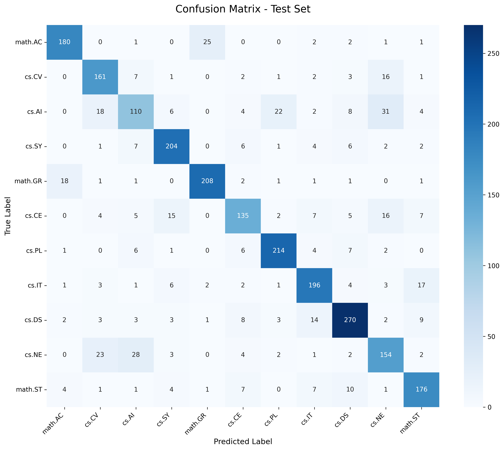
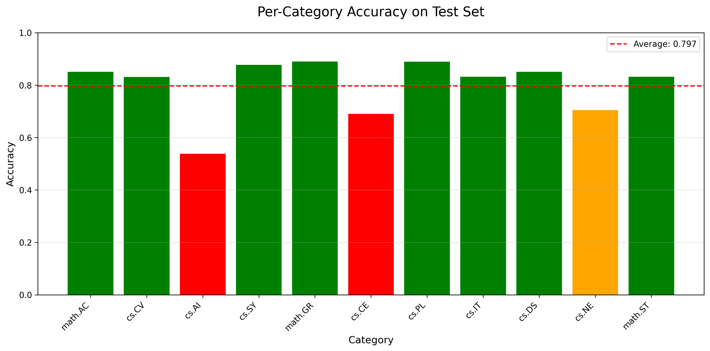

# BERT Research Paper Classifier

A deep learning project that fine-tunes BERT to classify academic research papers from arXiv into 11 categories with **80.32% accuracy**.

## Table of Contents
- [Overview](#overview)
- [Features](#features)
- [Dataset](#dataset)
- [Model Architecture](#model-architecture)
- [Results](#results)
- [Project Structure](#project-structure)
- [Installation](#installation)
- [Usage](#usage)
- [Training](#training)
- [Evaluation](#evaluation)
- [Future Improvements](#future-improvements)
- [Technologies Used](#technologies-used)
- [Acknowledgments](#acknowledgments)

## Overview

This project implements a document classification system using BERT (Bidirectional Encoder Representations from Transformers) to automatically categorize academic research papers. The model classifies papers into 11 different categories spanning Computer Science and Mathematics disciplines.

## Features

- Fine-tuned BERT-base model for multi-class classification (11 categories)
- Comprehensive evaluation with confusion matrices and per-category metrics
- Optimized for Apple Silicon (M4 Mac) using MPS acceleration
- Complete training pipeline with validation and early stopping
- Beautiful visualizations of model performance
- Clean, modular, production-ready code structure

## Dataset

**Source:** [arXiv Classification Dataset](https://huggingface.co/datasets/ccdv/arxiv-classification)

**Statistics:**
- **Total Papers:** 33,388 research papers
- **Training Set:** 28,388 papers
- **Validation Set:** 2,500 papers
- **Test Set:** 2,500 papers

**Categories (11):**
1. `math.AC` - Commutative Algebra
2. `cs.CV` - Computer Vision
3. `cs.AI` - Artificial Intelligence
4. `cs.SY` - Systems and Control
5. `math.GR` - Group Theory
6. `cs.CE` - Computational Engineering
7. `cs.PL` - Programming Languages
8. `cs.IT` - Information Theory
9. `cs.DS` - Data Structures and Algorithms
10. `cs.NE` - Neural and Evolutionary Computing
11. `math.ST` - Statistics Theory

**Data Processing:**
- Extracted abstracts from full paper text using regex patterns
- Average abstract length: ~1,532 characters (fits within BERT's 512 token limit)
- Handled various paper formats (different abstract headers, structures)
- Applied truncation for abstracts exceeding 512 tokens (~20% of dataset)

## Model Architecture

**Base Model:** `bert-base-uncased`
- **Parameters:** 109,490,699 trainable parameters
- **Architecture:** 12 transformer layers, 768 hidden dimensions
- **Classification Head:** Linear layer (768 → 11 classes)
- **Dropout:** 0.1 for regularization

**Model Pipeline:**
```
Input Text (Abstract)
    ↓
BERT Tokenizer (max_length=512, truncation=True)
    ↓
BERT Encoder (110M parameters)
    ↓
[CLS] Token Representation (768-dim)
    ↓
Dropout (p=0.1)
    ↓
Linear Classifier (768 → 11)
    ↓
Output (Category Probabilities)
```

## Results

### Overall Performance (After 1 Epoch)

| Metric | Training | Validation | Test |
|--------|----------|------------|------|
| **Accuracy** | 71.18% | 78.56% | **80.32%** |
| **Loss** | 0.9053 | 0.6565 | - |

### Per-Category Performance

| Category | Precision | Recall | F1-Score | Accuracy | Support |
|----------|-----------|--------|----------|----------|---------|
| math.GR | 0.8776 | 0.8889 | 0.8832 | **88.9%** | 234 |
| cs.PL | 0.8664 | 0.8880 | 0.8770 | **88.8%** | 241 |
| cs.DS | 0.8491 | 0.8491 | 0.8491 | **84.9%** | 318 |
| math.AC | 0.8738 | 0.8491 | 0.8612 | **84.9%** | 212 |
| cs.SY | 0.8395 | 0.8755 | 0.8571 | **87.6%** | 233 |
| cs.IT | 0.8167 | 0.8305 | 0.8235 | **83.1%** | 236 |
| math.ST | 0.8000 | 0.8302 | 0.8148 | **83.0%** | 212 |
| cs.CV | 0.7488 | 0.8299 | 0.7873 | **83.0%** | 194 |
| cs.NE | 0.6754 | 0.7032 | 0.6890 | **70.3%** | 219 |
| cs.CE | 0.7670 | 0.6888 | 0.7258 | **68.9%** | 196 |
| cs.AI | 0.6471 | 0.5366 | 0.5867 | **53.7%** | 205 |

**Key Insights:**
- Mathematics categories perform exceptionally well (84-89%)
- Most CS categories achieve >80% accuracy
- AI/Neural Computing overlap causes lower accuracy (conceptually similar)
- Model generalizes well: test accuracy > validation accuracy

### Visualizations

**Confusion Matrix:**



**Per-Category Accuracy:**



## Project Structure

```
bert-document-classifier/
├── data/
│   ├── raw/                      # Original dataset (gitignored)
│   └── processed/                # Processed abstracts (.pkl files)
├── models/
│   ├── checkpoint-best/          # Best model checkpoints
│   └── final-model/              # Final trained model
├── src/
│   ├── config.py                 # Configuration and hyperparameters
│   ├── data_loader.py            # Dataset loading and preprocessing
│   ├── model.py                  # BERT classifier architecture
│   ├── train.py                  # Training script
│   └── evaluate.py               # Evaluation and metrics
├── notebooks/
│   └── eda.ipynb                 # Exploratory Data Analysis
├── results/
│   ├── confusion_matrix.png      # Confusion matrix visualization
│   ├── per_class_accuracy.png    # Per-category accuracy plot
│   └── test_evaluation.json      # Detailed evaluation metrics
├── tests/
│   └── test_data_loader.py       # Unit tests
├── requirements.txt              # Python dependencies
├── .gitignore
└── README.md
```

## Installation

### Prerequisites
- Python 3.13+
- pip
- 8GB+ RAM (16GB recommended)
- GPU with 8GB+ VRAM (or Apple Silicon with MPS support)

### Setup

1. **Clone the repository:**
```bash
git clone https://github.com/YOUR_USERNAME/bert-research-paper-classifier.git
cd bert-research-paper-classifier
```

2. **Create a virtual environment:**
```bash
python -m venv venv
source venv/bin/activate  # On Windows: venv\Scripts\activate
```

3. **Install dependencies:**
```bash
pip install -r requirements.txt
```

4. **Download and process the dataset:**
```bash
python src/data_loader.py
```

This will:
- Download the arXiv dataset (~440MB)
- Extract abstracts from full papers
- Save processed data to `data/processed/`

## Usage

### Quick Test

Test the data loading pipeline:
```bash
python test_data_loader.py
```

Expected output:
```
Train: 28388 samples, 3549 batches
Val: 2500 samples, 313 batches
Test: 2500 samples, 313 batches
```

### Model Testing

Test the model architecture:
```bash
python src/model.py
```

Expected output:
```
Model created successfully!
Total parameters: 109,490,699
Model size: ~417.7 MB
```

## Training

### Configuration

Edit `src/config.py` to adjust hyperparameters:

```python
# Key hyperparameters
BATCH_SIZE = 8           # Adjust based on GPU memory
NUM_EPOCHS = 3           # Full training (1 epoch = ~20 min on M4 Mac)
LEARNING_RATE = 2e-5     # BERT fine-tuning learning rate
MAX_LENGTH = 512         # BERT's maximum sequence length
```

### Run Training

```bash
python src/train.py
```

**Training Time (on Apple M4 Mac with MPS):**
- 1 epoch: ~20-25 minutes
- 3 epochs: ~1-1.5 hours

**Output:**
- Best model saved to: `models/best_model.pth`
- Training metrics saved to: `results/training_results_[timestamp].json`

## Evaluation

Evaluate the trained model on the test set:

```bash
python src/evaluate.py
```

**Output:**
- Test accuracy and detailed metrics printed to console
- Confusion matrix: `results/confusion_matrix.png`
- Per-category accuracy: `results/per_class_accuracy.png`
- JSON results: `results/test_evaluation.json`

## Future Improvements

### Model Enhancements
- [ ] Train for full 3 epochs (expected ~85-88% accuracy)
- [ ] Experiment with larger models (BERT-large, RoBERTa)
- [ ] Implement learning rate scheduling strategies
- [ ] Add data augmentation (back-translation, synonym replacement)
- [ ] Handle class imbalance with weighted loss or oversampling

### Feature Additions
- [ ] Inference API for real-time classification
- [ ] Web interface (Streamlit or Gradio)
- [ ] Multi-label classification (papers with multiple categories)
- [ ] Confidence thresholds and "uncertain" class
- [ ] Explainability (attention visualization, LIME, SHAP)

### Engineering
- [ ] Comprehensive unit tests
- [ ] Docker containerization
- [ ] CI/CD pipeline
- [ ] Model quantization for faster inference
- [ ] Deploy to Hugging Face Spaces or AWS

## Technologies Used

**Core:**
- [PyTorch](https://pytorch.org/) - Deep learning framework
- [Transformers](https://huggingface.co/transformers/) - BERT implementation
- [Hugging Face Datasets](https://huggingface.co/docs/datasets/) - Dataset loading

**ML & Data:**
- [scikit-learn](https://scikit-learn.org/) - Evaluation metrics
- [NumPy](https://numpy.org/) - Numerical computing
- [Pandas](https://pandas.pydata.org/) - Data manipulation

**Visualization:**
- [Matplotlib](https://matplotlib.org/) - Plotting
- [Seaborn](https://seaborn.pydata.org/) - Statistical visualizations

**Development:**
- [Jupyter](https://jupyter.org/) - Interactive notebooks
- Git/GitHub - Version control

## Acknowledgments

- **Dataset:** [arXiv Classification Dataset](https://huggingface.co/datasets/ccdv/arxiv-classification) by ccdv
- **BERT Model:** [Google's BERT](https://github.com/google-research/bert)
- **Transformers Library:** [Hugging Face](https://huggingface.co/)


